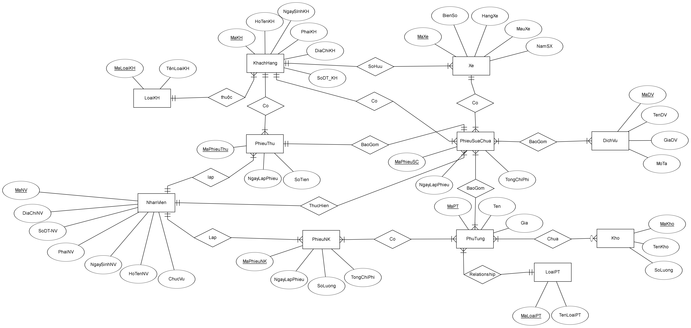

# 🚗 Gara Ô Tô – Database Design & Implementation

##  Giới thiệu
Dự án này được thực hiện trong khuôn khổ môn **Cơ sở dữ liệu nâng cao**, với mục tiêu:
- Phân tích, thiết kế & triển khai hệ thống **CSDL quản lý Gara Ô Tô**.
- Cung cấp giải pháp quản lý khách hàng, xe, dịch vụ, hóa đơn và phụ tùng.

Báo cáo bao gồm toàn bộ quá trình **từ khảo sát nghiệp vụ → thiết kế ERD → chuẩn hoá dữ liệu → triển khai SQL Server**.

---

##  Nội dung chính
- ** Phân tích & tài liệu:**
  - Báo cáo Word/PDF đầy đủ với khảo sát nghiệp vụ, mô hình dữ liệu, chuẩn hoá (1NF → BCNF).
- ** Thiết kế cơ sở dữ liệu:**
  - ERD (Entity Relationship Diagram).
  - Các bảng quan hệ với ràng buộc khoá chính – khoá ngoại.
- ** Triển khai SQL Server:**
  - Script `SQL_Scripts.sql` tạo database, bảng và dữ liệu mẫu.
- ** Trực quan hóa:**
  - Sơ đồ quan hệ (ERD) & hình minh hoạ quá trình làm việc.

---

##  Hướng dẫn sử dụng

### 1️ **Xem báo cáo**
📄 [📥 Tải Word](./DoAnCSDP_UP.docx)  
📄 [📄 Xem PDF](./DoAnCSDP_UP.pdf)

### 2️ **Chạy cơ sở dữ liệu**
1. Mở file `SQL_Scripts.sql` trong **SQL Server**.  
2. Chạy toàn bộ script để tạo database `GaraOtoDB`, các bảng, ràng buộc và dữ liệu mẫu.  
3. Kiểm tra dữ liệu mẫu bằng các câu lệnh `SELECT`.

---

##  ERD & Minh hoạ
  
*Sơ đồ quan hệ thực thể cho hệ thống quản lý Gara Ô Tô.*

---

##  Tác giả
**Phạm Duy Hiếu – 22DH111081**  
📧 **Email:** phamduyhieu352004@gmail.com  
🏫 **Trường Đại học Ngoại Ngữ – Tin Học TP.HCM (HUFLIT)**

